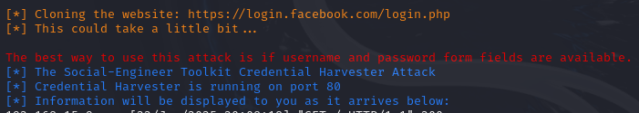
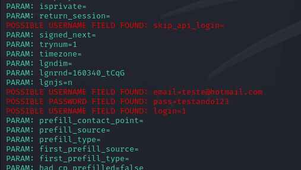

# Phishing para captura de senhas do Facebook

### Ferramentas

- Kali Linux
- setoolkit

### Configurando o Phishing no Kali Linux

- Abra o terminal.
- Mude para root: ``` sudo su ```
- Iniciando o setoolkit: ``` setoolkit ```

Será mostrado um menu, escolha as opções digitando o numero correspondente e confirme com Enter.

- Tipo de ataque: Opção 1: ``` Social-Engineering Attacks ```
- Vetor de ataque: Opção 2: ``` Web Site Attack Vectors ```
- Método de ataque: Opção 3: ```Credential Harvester Attack Method ```
- Método de ataque: Opção 2: ``` Site Cloner ```

Será sugerido um IP para ser usado como site clonado, esse IP será do seu micro Kali.
Se estiver correto, confirme com Enter, se não tiver certeza, confirme o IP através do comando ``` ifconfig ```

Continuando, será solicitado o site a ser clonado
- Enter the url to clone: http://www.facebook.com

Se tudo correu bem, uma mensagem semelhante a essa será exibida:


- Feito isso, acesse de outro micro que esteja na mesma rede o endereço http://www.facebook.com
- Tente realizar o login na página clonada
- Volte no Kali e localize no terminal os parâmetros abaixo:


